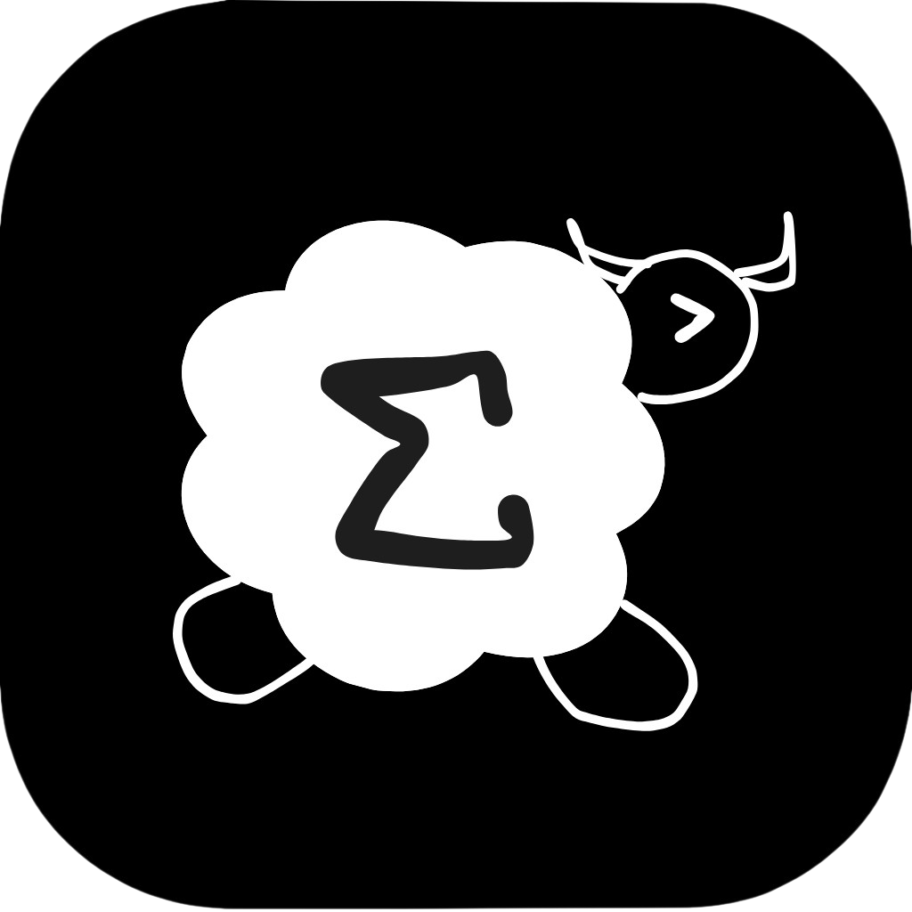
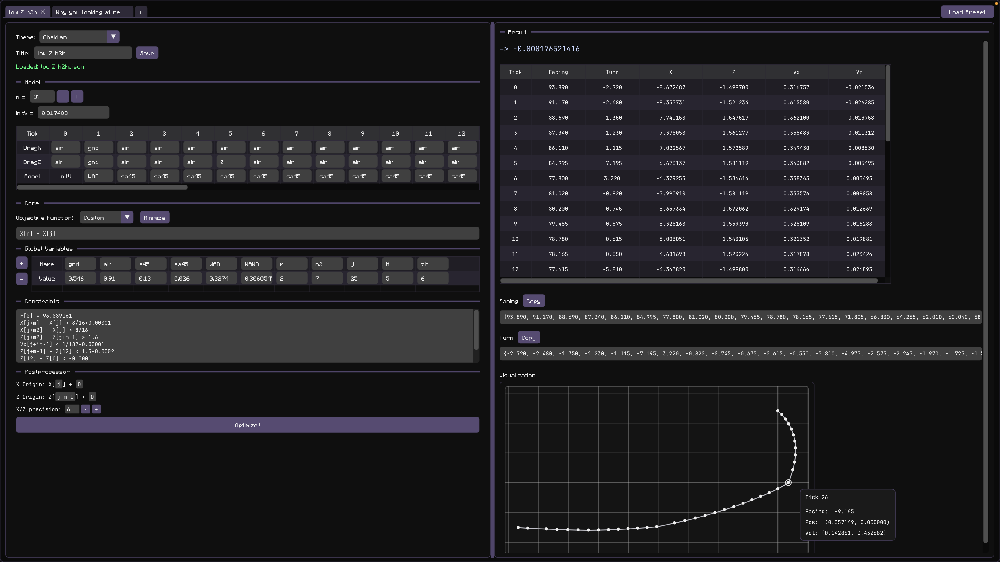
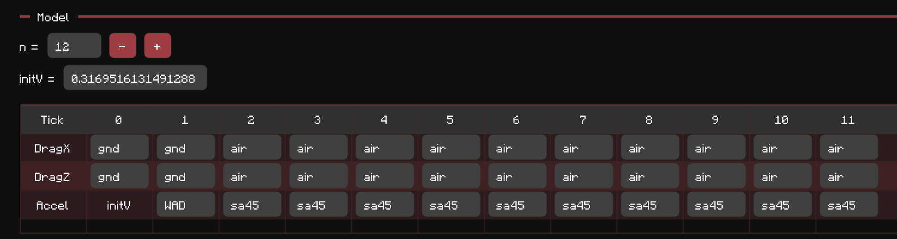

# Sheepram



Sheepram is a tool for solving **Minecraft Onejump angle optimization problems**. With custom language and numerical optimizer written entirely from scratch.

## Table of Contents

* [Sheepram](#sheepram)
  * [Guide](#guide)
  * [Tips](#tips)
  * [Installation](#installation)
  * [User Data Location](#user-data-location)
* [Technical section](#️-you-might-not-want-to-visit-this-section)

  * [Project Components](#project-components)
  * [Movement Optimization in Minecraft](#movement-optimization-in-minecraft)

    * [1. Building the Movement Model](#1-building-the-movement-model)
    * [2. Objective Function](#2-objective-function-1)
    * [3. Constraints](#3-constraints-1)
    * [4. Unknown Variables](#4-unknown-variables)
    * [5. Scripting Language and Parser](#5-scripting-language-and-parser)
    * [6. Optimization Algorithm](#6-optimization-algorithm)
  * [Future Prospect](#future-prospect)


### Preview (`low Z h2h.json` by HammSamichz)



## Guide

### 1. Model (Drags & Accels Table)

The solver assumes you already know the movement state for each tick.
Sheepram optimizes the **angles only**.

### 2. Objective Function

This is the value you want to optimize.

Examples:

* `X[n]`
* `Z[n]`
* a custom expression written in the scripting language

### 3. Global Variables

Optional, but useful for:

* reusing constants
* defining indices relative to something else

### 4. Constraints

You can write constraints using the custom scripting language.

Supported indexed variables:

| Variable | Meaning                     |
| -------- | --------------------------- |
| `X[i]`   | X position at tick `i`      |
| `Z[i]`   | Z position at tick `i`      |
| `Vx[i]`  | X velocity: `X[i+1] - X[i]` |
| `Vz[i]`  | Z velocity: `Z[i+1] - Z[i]` |
| `F[i]`   | Facing angle (degrees)      |
| `T[i]`   | Turn: `F[i+1] - F[i]`       |

Example:

```txt
// Every non-comment line is parsed as a constraint

F[1] - F[0] = -45
// Equivalent to T[0] = -45
// Probably useful in noja

X[m] - X[0] > 8/16
// m must be defined in the table above

X[m2] > 0.5
// Since X[0] and Z[0] are always 0, you can omit them
// Yes, something goofy like X[X[X[X[0]]]] still compiles

Z[m2] - Z[m-1] > 1 + 0.6
Z[n] - Z[m-1] < 1.5625 + 0.6

Vx[it] < 0.005/0.91
// Means you hit inertia on X while tick = it in the air
// You should also set dragX = 0 on that tick
```

Nonlinear expressions such as `X[1] * X[2]` are not supported and will not compile.

### 5. Postprocessor

The postprocessor lets you:

* shift the coordinate origin (affects the output table and plot)
* change table precision
* change angle offsets (only affects the manual copy section)

## Tips

### Resizing

* You can resize the constraint panel vertically.
* You can drag the divider between the input and output panels.

### Table insertion / deletion

You can select a slot in the table (both in the model table and the global variables table), then press the `+` or `-` button.

* On the model table, `+` duplicates the selected column.
* On the global variables table, `+` inserts an empty column.

### Plot hover

Hovering over a plotted point shows information for that tick.

### Global variable declaration order

Variables are declared in the following order:

`n` → `initV` → table entries from left to right

A later variable may use previously defined variables.
Redefining a variable overwrites the old value.

## Installation

Download the `.zip` for your platform from the latest release.

### macOS

1. Unzip the downloaded file.
2. Drag `Sheepram.app` into `Applications`.
3. Open `Sheepram.app`.

### Windows

1. Unzip the downloaded file.
2. Open the extracted folder.
3. Double-click `Sheepram.exe`.

Keep all shipped files in the extracted folder:

* `Sheepram.exe`
* `asset/`
* `presets/`
* bundled `.dll` files

### Known Issues (Windows)

#### Error

`GLFW Error 65544: WGL: Failed to make context current: The handle is invalid.`

This can happen on dual-GPU laptops (integrated + discrete GPU) when Windows runs the app on the wrong GPU path.

#### Fix

1. Open `Settings` → `System` → `Display` → `Graphics`.
2. Add `Sheepram.exe`.
3. Click `Options`.
4. Choose `High performance`.
5. Save and restart the app.

If needed, also force `Sheepram.exe` to use the discrete GPU in the NVIDIA / AMD control panel.

### Linux

1. If downloaded from workflow artifacts, unzip first to get `Sheepram-<version>-linux-x86_64.tar.gz`.
2. Extract `Sheepram-<version>-linux-x86_64.tar.gz`.
3. Open a terminal in the extracted folder.
4. Run:

```bash
chmod +x Sheepram
./Sheepram
```

`Sheepram` is the launcher script. It loads bundled libraries from `lib/` before starting `Sheepram.bin`.

Optional launcher:

```bash
chmod +x Sheepram.desktop
```

Then open `Sheepram.desktop` from your desktop environment.

## User Data Location

Sheepram stores preferences and presets in the user data directory:

* macOS: `~/Library/Application Support/Sheepram`
* Windows: `%APPDATA%\Sheepram`
* Linux: `~/.local/share/Sheepram`

---

# ⚠️ You might not want to visit this section

### Project Components

The system consists of three main components:

- **Numerical optimization engine**: `optimizer.cpp / optimizer.hpp`
- **Expression parser (DSL compiler)**: `parser.cpp / parser.hpp`
- **GUI built with Dear ImGui**: `main.cpp`

## Movement Optimization in Minecraft


### 1. Building the Movement Model

Our optimization problems are built on the **Minecraft horizontal movement model**. The full formulas can be found on the [Mcpk Wiki](https://www.mcpk.wiki/wiki/Horizontal_Movement_Formulas).

Horizontal velocity follows the following “linear” recurrence relation (with trigonometric terms):

$$
\begin{aligned}
Vx[t + 1] &= drag[t] \cdot Vx[t] + accel[t] \cdot \sin(\theta_t) \\
Vz[t + 1] &= drag[t] \cdot Vz[t] + accel[t] \cdot \cos(\theta_t)
\end{aligned}
$$

where

* $t$ is measured in game ticks; in real time, 1 second = 20 ticks
* $\theta_t$ is the player’s facing angle at tick $t$
* $drag[t]$ depends on block slipperiness
* $accel[t]$ depends on the player’s movement state (ground, air, sprint, etc.)

Position is then obtained by summing the velocity at each tick:

$$
\begin{aligned}
X[t] &= X[t-1] + Vx[t-1] \\
Z[t] &= Z[t-1] + Vz[t-1]
\end{aligned}
$$

Sheepram assumes that:

* the **block type** at each tick is known
* the **movement method** at each tick (ground, air, etc.) is predetermined

This avoids introducing additional discrete variables into the optimization problem.

### 2. Objective Function

For most Minecraft Onejump problems, the goal is to minimize or maximize movement along a particular axis. A common **objective function** is:

$$
X[n] - X[mm]
$$

where $n$ denotes the last tick of the simulation, and $mm$ denotes the last momentum tick, that is, the tick just before the player leaves the takeoff block.

### 3. Constraints

From the perspective of stratfinding, Minecraft jumps can roughly be divided into three categories (excluding gimmick-based cases):

* **Single-Axis Distance Jump**:
  These jumps are already **solved**. Their strategies can be derived using explicit formulas and algorithms. (As shown in my GitHub repo: [Stratfinder](https://github.com/Curryocity/Stratfinder)) This is mainly because in most cases $\theta = 0$, so the movement formula reduces to a purely linear function.

* **Double-Axis Distance Jump**:
  These jumps are only partially **solved**. The reason they are not fully solved is that the main direction of the run-up and the main direction after takeoff are not necessarily aligned, so finding the optimal interpolation between the two directions becomes quite complicated. These cases, as well as the next category, Neo, require numerical methods.

* **Neo**:
  This is the rabbit hole of Onejump stratfinding. It broadly refers to jumps that require wrapping around obstacles such as walls or corners. Much like turning in an acceleration-based racing game, the optimal route is not simply the geometric boundary. Instead, it is a trade-off between short-term distance loss and later velocity gain.

One major reason constraints are needed is precisely to describe Neo problems. Intuitively, we want the player to go around a wall and then move as far left (negative $X$) as possible after passing it.

> **A missing image of c4.5 p2p in-game with path visualization**

The constraints are used to **encode** what it means to “go around the wall.” In the example above, this can be written as:

```Sheepram
// At t = m, the player first reaches the +X side of the pillar
X[m] - X[0] > 7/16

// At t = m2, the player is about to wrap to the -X side of the pillar on the next tick
X[m2] - X[0] > 7/16

// Describes the pillar's length in the Z direction
// m-1 is used because Minecraft updates player X before Z
Z[m2] - Z[m-1] > 1 + 0.6000000238418579

// Here m = 2, m2 = 8
// Player hitbox width = 0.6f (f32)
```

### 4. Unknown Variables

Since $drag[t]$, $accel[t]$, and the initial conditions are numerically known in advance, Sheepram simplifies / compiles every expression into a function that depends only on the $\theta_t$'s. More specifically, it reduces them to the form

$$
f(\theta) =
c +
\sum_i a_i \theta_i +
\sum_i b_i \sin(\theta_i) +
\sum_i d_i \cos(\theta_i)
$$

So the unknown variables are simply the player’s **facing angles** at each tick:

$$
\theta_0, \theta_1, \dots, \theta_{n-1}
$$

This representation allows the solver to compute **objective values** and **constraint values** efficiently, without re-evaluating the full movement model during every optimization step. In addition, it allows the gradient to be computed directly:

$$
\frac{\partial f}{\partial \theta_i} = a_i + b_i \cos(\theta_i) - d_i \sin(\theta_i)
$$

so numerical differentiation is not needed.

### 5. Scripting Language and Parser

This scripting language is parsed using a **Pratt parser** (the reference I used at the time was [Simple but Powerful Pratt Parsing](https://matklad.github.io/2020/04/13/simple-but-powerful-pratt-parsing.html)).

Supported operations include:

* addition and subtraction
* multiplication and division by constants
* parentheses
* comparison operators
* built-in indexed physics variables

The constraint language supports the following indexed variables:

| Variable | Meaning                  |
| -------- | ------------------------ |
| `X[i]`   | X position at tick i     |
| `Z[i]`   | Z position at tick i     |
| `Vx[i]`  | X velocity at tick i     |
| `Vz[i]`  | Z velocity at tick i     |
| `F[i]`   | Facing angle (degrees)   |
| `T[i]`   | Turn angle between ticks |

For example:

```txt
X[7] - X[0] > 0.4375
T[3] < 45
```

where

* `F[i]` represents the facing direction
* `T[i] = F[i+1] - F[i]` represents the turn between adjacent ticks

To preserve the symbolic structure, **nonlinear multiplication is not allowed**. Otherwise, expressions such as $\sin(\theta) \cdot \cos(\theta)$ would introduce data types the system is not designed to handle.

### 6. Optimization Algorithm

**Overall idea:** Convert the constrained problem into an unconstrained one, then optimize it using methods such as gradient descent, quasi-Newton methods, or Newton’s method.

#### From Constrained to Unconstrained Optimization

Consider a constrained optimization problem:

$$
\begin{aligned}
\min_{\theta} \quad & f(\theta) \\
\text{subject to} \quad & g_i(\theta) \le 0
\end{aligned}
$$

The classical approach introduces **Lagrange multipliers**:

$$
L(\theta,\lambda) = f(\theta) + \sum_i \lambda_i g_i(\theta)
$$

At the optimal solution, the **KKT conditions** must hold.
**However, directly solving the KKT system is often difficult in practice**, so the multipliers $\lambda_i$ are not easy to solve for directly.

### Candidate Alternative: Penalty Method

One idea is to introduce a **penalty term** $\rho$ to penalize solutions that violate the constraints:

$$
\min_\theta f(\theta) + \rho \sum_i \max(0,g_i(\theta))^2
$$

But this has a major drawback: when $\rho$ becomes large, the optimization problem becomes **numerically ill-conditioned**, and convergence becomes unstable.

### Augmented Lagrangian Method (ALM)

The **Augmented Lagrangian Method** combines the ideas of the penalty method and Lagrange multipliers.

Its core idea is not to solve for $\lambda$ analytically, but to **iteratively update and learn $\lambda$** through the additional penalty term.

The augmented Lagrangian is defined as:

$$
L(\theta,\lambda) =
f(\theta)
+
\sum_i \lambda_i g_i(\theta)
+
\frac{\rho}{2}\sum_i \max(0,g_i(\theta))^2
$$

where $\lambda_i$ are the Lagrange multipliers and $\rho$ is the penalty parameter.

### ALM Algorithm (Outer Loop)

#### Step 1: Solve the unconstrained subproblem

For fixed multipliers $\lambda$ and penalty parameter $\rho$, minimize

$$
\min_\theta L(\theta,\lambda)
$$

This subproblem can be solved using any unconstrained optimization method. Solving this subproblem is what we call the inner loop iteration.

The goal of the inner loop is to approach **stationarity**, that is,

$$
\nabla_\theta L(\theta,\lambda) \approx 0
$$

#### Step 2: Update multipliers

After obtaining the current solution $\theta$, update the multipliers as

$$
\lambda_{i,\text{new}} =
\max\left(0,\lambda_i + \rho g_i(\theta)\right)
$$

When a constraint is violated, this update increases the corresponding multiplier.

#### Step 3: Adjust the penalty parameter

If the constraint violation is still large, increase the penalty parameter $\rho$ to enforce the constraints more strongly.

#### Step 4: Repeat until convergence

The **outer loop** keeps updating the multipliers and penalty parameter, gradually pushing the solution toward **constraint feasibility**. Once the constraint violation falls below a specified tolerance, the algorithm stops.

At that point, the solution approximately satisfies the **KKT conditions**.

### Inner Loop

The **inner loop** minimizes the Augmented Lagrangian and drives the solution toward **stationarity**. It terminates when the gradient of the Augmented Lagrangian becomes sufficiently small. Common methods for this type of unconstrained optimization problem include:

#### 1. Gradient Descent

This method repeatedly moves in the locally best linear descent direction, that is, the negative gradient.

It is computationally cheap because it only requires gradient evaluations. This makes it suitable for problems with very many parameters, such as machine learning, where second-order information is too expensive to compute.

However, it usually achieves only **linear convergence**, which becomes slow when high precision is needed.

#### 2. Newton’s Method

This method locally approximates the objective function with a quadratic function, then moves toward that extremum.

Near the optimum, it has **quadratic convergence**, but it also has several drawbacks:

* computing the Hessian matrix is expensive
* computing its inverse is also expensive
* the Hessian may be indefinite (pointing toward a non-minimum)

#### 3. Quasi-Newton: A Middle Ground

Quasi-Newton methods iteratively approximate the inverse Hessian using lighter-weight updates, while still achieving **superlinear convergence**.

**The quasi-Newton method used in Sheepram is BFGS**.

It works by maintaining an approximation $H$ of the inverse Hessian.

1. **Secant condition**:

   The updated inverse Hessian approximation must satisfy the secant equation at the current iteration:

$$
H \Delta grad(f) = \Delta \theta
$$

2. **Symmetry**:

   Like the inverse Hessian, the approximation matrix must remain symmetric.

3. **Least-change principle**:

   Among all matrices satisfying the secant condition, BFGS chooses the one “closest” to the previous inverse Hessian approximation.

   The idea is to preserve as much gradient information from previous iterations as possible. The exact meaning of “closest” depends on the particular quasi-Newton method.

**BFGS Update Formula**

Combining the three conditions above leads uniquely to the BFGS update formula:

$$
H_{k+1} =
\left(I - \rho_k s_k y_k^T\right)
H_k
\left(I - \rho_k y_k s_k^T\right)
+
\rho_k s_k s_k^T
$$

where

$$
s_k = \theta_{k+1} - \theta_k ,\quad
y_k = \nabla f_{k+1} - \nabla f_k ,\quad
\rho_k = \frac{1}{y_k^T s_k}
$$

I will not discuss the full derivation here (see [8.2 Quasi Newton and BFGS](https://youtu.be/QGFct_3HMzk?si=vemD5LnGdvlkR7mw)), but this is my intuition:

1. the sandwich structure $AHA^T$ preserves symmetry
2. the two “bread” terms in the sandwich only apply a rank-two update to $H$, so the change is minimal
3. the $\rho_k s_k s_k^T$ term adds new curvature information and ensures the secant condition is satisfied

#### Line Search

As mentioned in this video:
[Understanding scipy.minimize part 2: Line search](https://youtu.be/kM79eCS9cs8?si=67L2rNwh0u_D-BfG)

Modern numerical libraries usually **do not move directly to the minimizer predicted by the inverse Hessian approximation**. Instead, they treat it as a reference direction, and perform a **line search** along that direction to determine a suitable step length $\alpha_k$:

$$
\theta_{k+1} = \theta_k + \alpha_k p_k
$$

The purpose of line search is to ensure the quality of each iteration (**Wolfe conditions**):

1. the objective decreases sufficiently (**Armijo condition**)
2. the slope becomes sufficiently small; otherwise we should keep moving forward (**curvature condition**)

Line search is important in practice because it helps prevent divergence when the local quadratic model is inaccurate.

In my project, I use a weaker line search implementation than SciPy: its zoom phase mainly uses binary search instead of polynomial interpolation. I will not go into those details here.

### Algorithm Summary

Sheepram uses an **Augmented Lagrangian outer loop** together with a **BFGS inner loop** to solve the constrained optimization problem.

#### Pseudocode

```text
initialize θ, λ, rho

loop:
    construct L(θ, λ)
    loop:
        compute ∇L(θ, λ)
        compute BFGS search direction p
        choose step length α by line search
        update θ ← θ + αp
        update inverse Hessian approximation H
    end-if stationarity is reached

    update λ_i ← max(0, λ_i + rho * g_i(θ))

    if constraint violation is still large:
        increase rho
end-if feasibility are reached

return θ, trajectory, objective value
```

## Future Prospect

1. **Significant angles**: Minecraft angles are not truly continuous. Minecraft’s trigonometric functions rely on a lookup table with 65,536 precomputed values.

```cpp
static void init(){
    for (int i = 0; i < 65536; ++i)
        SIN_TABLE[i] = std::sin(i * PId * 2.0 / 65536.0);
}

static inline float sinr(float rad){
    return SIN_TABLE[(int)(rad * 10430.378f) & 65535];
}

static inline float cosr(float rad){
    return SIN_TABLE[(int)(rad * 10430.378f + 16384.0f) & 65535];
}
```

Taking this discrete angle structure into account during optimization would be a very interesting direction. In fact, I already have many ideas for it, such as **simulated annealing**, **limited-window-size 2-opt**, and **coordinate descent**.

2. **Integrating Mothball movement syntax**: [Mothball](https://github.com/CyrenArkade/mothball) is a language developed by CyrenArkade that can describe Minecraft player movement concisely, and it also includes many built-in functions commonly used in stratfinding. 

I may replace the Drag / Accel table with Mothball syntax. For example, a table like this:



could be reduced to a single line of script:

```Sheepram
initV(0.3169516131491288) sj sa.wa(11)
```

