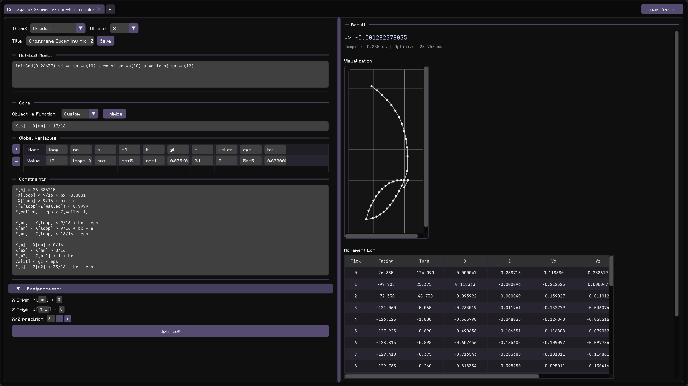

# Sheepram


Sheepram is a tool for solving **Minecraft Onejump angle optimization problems**. With custom language and numerical optimizer written entirely from scratch.

## Table of Contents

* **Sheepram**
  * [Guide](#guide)
  * [Tips](#tips)
  * [Installation](#installation)
  * [User Data Location](#user-data-location)
  * [Build and run from source](#build-and-run-from-source)

For the movement mathematics, expression representation, and optimization
algorithm, see the [Technical Guide](TECHNICAL.md).


### Preview ([Click here to see what it is trying to solve](https://youtu.be/0tYHrP3-yiY))



## Guide

For a detailed, complete example of modelling and solving a c4.5 p2p neo, see
the [P2P example](P2P.md).

### 1. Movement Model

Describe the movement timeline with the built-in Mothball-style DSL. The script
generates the model length, drag, acceleration, and movement-relative angle
offsets. Sheepram then optimizes the **facing angles only**.

```Sheepram
initGnd(0.3169516131491288) sj.w sa.wa(11)
```

#### Mothball Syntax Quick Guide

| Function | Movement state |
| --- | --- |
| `w` | Walking |
| `s` | Sprinting |
| `sn` | Sneaking |
| `sns` | Sneaking while sprinting |
| `st` | No movement input|

> [!NOTE]
> Sheepram does not have sprint delay.

Movement functions support these modifiers:

| Syntax | Description |
| --- | --- |
| `j` suffix | Performs the movement as a jump, for example `sj`.  |
| `a` suffix | Performs the movement in air, for example `sa`. |
| `.input` | Sets the movement keys using any valid combination of `w`, `a`, `s`, and `d`, for example `s.wa` or `sa.d`. Without it, movement defaults to forward (`w`). |
| `(duration)` | Repeats the movement for a positive whole-number duration, for example `sa.wa(11)`. The duration may be a literal or a global variable. |

Examples:

```Sheepram
sj.w          // sprint-jump forward for one tick
sa.wa(11)     // sprint in air, holding W+A, for 11 ticks
sn.s          // sneak backward
st            // no input for one tick
r(3) { s.w sa.w }
```

#### Other commands supported in Sheepram

| Command | Description |
| --- | --- |
| `initGnd(vel)`/ `initAir(vel)` | Sets the initial velocity. Two variants differs by previous slip (initGnd takes the current slip when it is executed). One of them must appear exactly once and should normally be the first command. |
| `slip(value)` | Sets the ground slipperiness used by subsequent ground movements. The default is `0.6`. |
| `speed(level)`/`slow(level)` | Sets the Speed/Slowness effect level. The level must be a whole number from `0` to `255`. |
| `ix` | Forces X inertia on the first tick of the next movement by setting its X drag to zero. |
| `iz` | Forces Z inertia on the first tick of the next movement by setting its Z drag to zero. |
| `mv(drag, accel, duration = 1)` | Adds a custom movement segment with the given drag, acceleration and optional duration. |
| `r(count) { ... }` | Repeats a non-empty block of movement functions and commands. `loop(...)` and `repeat(...)` are aliases. |

Command arguments may use arithmetic and variables from the global-variable
table.

#### Markers

Markers give a name to a value at the current point in the Mothball timeline.
Each marker command accepts exactly one name:

| Command | Marked value |
| --- | --- |
| `X(name)` | X position |
| `Z(name)` | Z position |
| `Vx(name)` | X velocity |
| `Vz(name)` | Z velocity |
| `F(name)` | Facing angle |
| `T(name)` | Turn to the next tick |

For example:

```Sheepram
initGnd(0.31695) sj.w Z(z1) sa.wa(7) Z(z2)
```

This records the Z position after `sj.w` as `z1`, and the Z position after the
following seven air ticks as `z2`. Marker names can then be used as expressions
in the objective, constraints, and postprocessor:

```text
z2 - z1 > 1.6
```

In this case, equivalent to: 

```text
Z[8] - Z[1] > 1.6
```

A marker name cannot conflict with a global variable, reserved name, or
another marker. `Vx()`, `Vz()`, and `T()` cannot mark the terminal tick because
they require a following tick.


### 2. Objective Function

This is the value you want to optimize.

Examples:

* `X[n]`
* `Z[n]`
* a custom expression written in the scripting language

### 3. Global Variables

Optional, but useful for:

* reusing constants
* defining indices relative to something else

### 4. Constraints

You can write constraints using the custom scripting language.

Supported indexed variables:

| Variable | Meaning                     |
| -------- | --------------------------- |
| `X[i]`   | X position at tick `i`      |
| `Z[i]`   | Z position at tick `i`      |
| `Vx[i]`  | X velocity: `X[i+1] - X[i]` |
| `Vz[i]`  | Z velocity: `Z[i+1] - Z[i]` |
| `F[i]`   | Facing angle (degrees)      |
| `T[i]`   | Turn: `F[i+1] - F[i]`       |

Example:

```txt
// Every non-comment line is parsed as a constraint

F[1] - F[0] = -45
// Equivalent to T[0] = -45
// Probably useful in noja

X[m] - X[0] > 8/16
// m must be defined in the table above

X[m2] > 0.5
// Since X[0] and Z[0] are always 0, you can omit them
// Yes, something goofy like X[X[X[X[0]]]] still compiles

Z[m2] - Z[m-1] > 1 + 0.6
Z[n] - Z[m-1] < 1.5625 + 0.6

Vx[it] < 0.005/0.91
// Means you hit inertia on X while tick = it in the air
// Use ix before that movement tick in the movement script
```

Nonlinear expressions such as `X[1] * X[2]` are not supported and will not compile.

### 5. Postprocessor

The postprocessor lets you:

* shift the coordinate origin (affects the output table and plot)
* change table precision

X Origin and Z Origin are full expression fields. They accept the same
variables, markers, and model expressions as the objective and constraints.
For example, a marker declared with `X(x1)` in Mothball can be used as:

```text
X Origin: x1 + 0.3
Z Origin: Z[m-1]
```

## Tips

### Global variable declaration order

Table entries are evaluated from top to bottom. A variable may reference
previously defined variables. Redefining a user variable overwrites its
previous value.

The declaration order is:

```text
global variables → Mothball model → n
```

Global variables cannot reference `n`. After Mothball generates the model,
`n` becomes available to the objective, constraints, and postprocessor. It is
reserved and cannot be redefined.

### Double Rotator Trick: Optimizing Initial Velocity

The double rotator trick represents the initial velocity as the sum of two
velocity vectors with independently optimized directions. To cover an exact
speed range $[min, max]$, define:

$$A = \frac{min+max}{2}, \qquad B = \frac{max-min}{2}$$

Then:

$$z = Ae^{i\alpha}+Be^{i\beta}$$

By the triangle inequality, the resulting speed satisfies:

$$min \le |z| \le max$$

For a normal ground tick with slip `0.6`:

```txt
slip(1/0.91)
initGnd((min+max)/2)
mv(0.91*0.6, (max-min)/2)
slip(0.6)
```

For an air tick:

```txt
slip(1/0.91)
initGnd((min+max)/2)
mv(0.91, (max-min)/2)
slip(0.6)
```

Setting the initial drag to `1` makes the two velocities additive. The
`mv(...)` drag controls whether the combined velocity receives ground or air
drag on the following tick. The `mv(...)` tick is visible in the result table
and counts normally in all indices.

> **Numerical stability:** Avoid choosing a `min` that is extremely small
> relative to `max`. This makes $A$ and $B$ nearly equal, so reaching the lower
> speed bound requires near-perfect cancellation. In that region, tiny changes
> to either facing angle can cause large changes in the resulting direction
> and make optimization less reliable.

## Installation

Download the `.zip` for your platform from the latest release.

### macOS

1. Unzip the downloaded file.
2. Drag `Sheepram.app` into `Applications`.
3. Open `Sheepram.app`.

### Windows

1. Unzip the downloaded file.
2. Open the extracted folder.
3. Double-click `Sheepram.exe`.

Keep all shipped files in the extracted folder:

* `Sheepram.exe`
* `asset/`
* bundled `.dll` files

### Known Issues (Windows)

#### Error

`GLFW Error 65544: WGL: Failed to make context current: The handle is invalid.`

This can happen on dual-GPU laptops (integrated + discrete GPU) when Windows runs the app on the wrong GPU path.

#### Fix

1. Open `Settings` → `System` → `Display` → `Graphics`.
2. Add `Sheepram.exe`.
3. Click `Options`.
4. Choose `High performance`.
5. Save and restart the app.

If needed, also force `Sheepram.exe` to use the discrete GPU in the NVIDIA / AMD control panel.

### Linux

1. If downloaded from workflow artifacts, unzip first to get `Sheepram-<version>-linux-x86_64.tar.gz`.
2. Extract `Sheepram-<version>-linux-x86_64.tar.gz`.
3. Open a terminal in the extracted folder.
4. Run:

```bash
chmod +x Sheepram
./Sheepram
```

`Sheepram` is the launcher script. It loads bundled libraries from `lib/` before starting `Sheepram.bin`.

Optional launcher:

```bash
chmod +x Sheepram.desktop
```

Then open `Sheepram.desktop` from your desktop environment.

## User Data Location

Sheepram stores preferences and presets in the user data directory:

* macOS: `~/Library/Application Support/Sheepram`
* Windows: `%APPDATA%\Sheepram`
* Linux: `~/.local/share/Sheepram`

## Build and run from source

**Build:**

```sh
make imgui-deps
make debug
```

( do`make release`for more performant build )

**Run:**
```sh
./build/Sheepram
```

> [!NOTE]
> Sheepram was rewritten in [Odin](https://odin-lang.org/).
> The previous C++ implementation is preserved on the
> [`legacy-cpp`](../../tree/legacy-cpp) branch.
