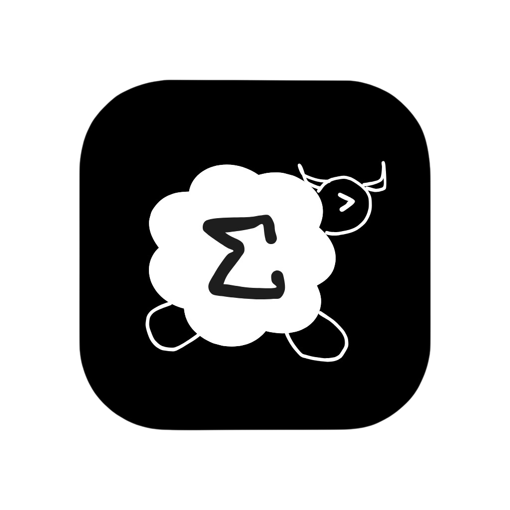

# Sheepram

A cross platform Bitcoin miner, very professional vscode setup by me.



## Download

Get the package for your platform from the latest release/workflow artifacts:

- macOS ARM64: `Sheepram-<version>-macos-arm64.zip`
- macOS x86_64 (Intel): `Sheepram-<version>-macos-x86_64.zip`
- Windows x86_64: `Sheepram-<version>-windows-x86_64.zip`
- Linux x86_64: `Sheepram-<version>-linux-x86_64.tar.gz`

## Install and Run

### macOS

1. Unzip the downloaded file.
2. Drag `Sheepram.app` to `Applications`.
3. Open `Sheepram.app`.

If macOS blocks the app with a security warning, run:

```bash
xattr -dr com.apple.quarantine /Applications/Sheepram.app
```

Then open the app again.

### Windows

1. Unzip the downloaded file.
2. Open the extracted folder.
3. Double-click `Sheepram.exe`.

Keep all shipped files in the extracted folder (`Sheepram.exe`, `asset/`, `presets/`, bundled `.dll` files).

### Linux

1. Extract the downloaded `tar.gz`.
2. Open terminal in the extracted folder.
3. Run:

```bash
chmod +x Sheepram
./Sheepram
```

`Sheepram` is the launcher script and loads bundled libraries from `lib/` before starting `Sheepram.bin`.

Optional launcher:

```bash
chmod +x Sheepram.desktop
```

Then open `Sheepram.desktop` in your desktop environment.

## User Data Location

Sheepram stores preferences and presets in your user data directory:

- macOS: `~/Library/Application Support/Sheepram`
- Windows: `%APPDATA%\\Sheepram`
- Linux: `~/.local/share/Sheepram`

## Build From Source

### macOS

```bash
brew install glfw
make -j8 debug
./build/main
```

### Linux

```bash
sudo apt-get update
sudo apt-get install -y build-essential pkg-config libglfw3-dev libgtk-3-dev libgl1-mesa-dev
make -j8 debug
./build/Linux-x86_64/main
```

### Windows (MSYS2 / MinGW64)

Install dependencies in `MINGW64` shell:

```bash
pacman -S --needed make mingw-w64-x86_64-toolchain mingw-w64-x86_64-glfw mingw-w64-x86_64-gtk3
make -j8 debug UNAME_S=MINGW64_NT ARCH=x86_64
./build/MINGW64_NT-x86_64/main.exe
```

## Packaging

```bash
make package-macos-arm64 VERSION=v0.1.0
make package-macos-x86_64 VERSION=v0.1.0
make package-linux-x86_64 VERSION=v0.1.0
make package-windows-x86_64 VERSION=v0.1.0
```

Artifacts are generated in `dist/`.
